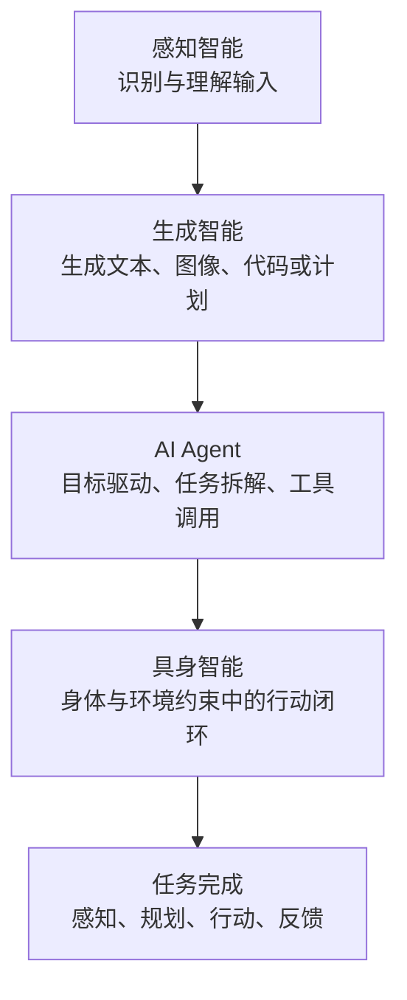
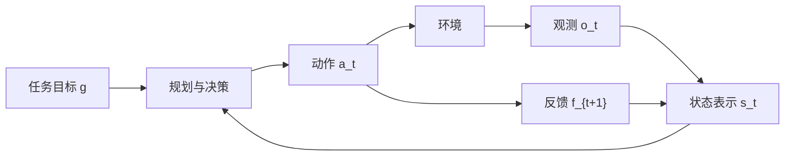
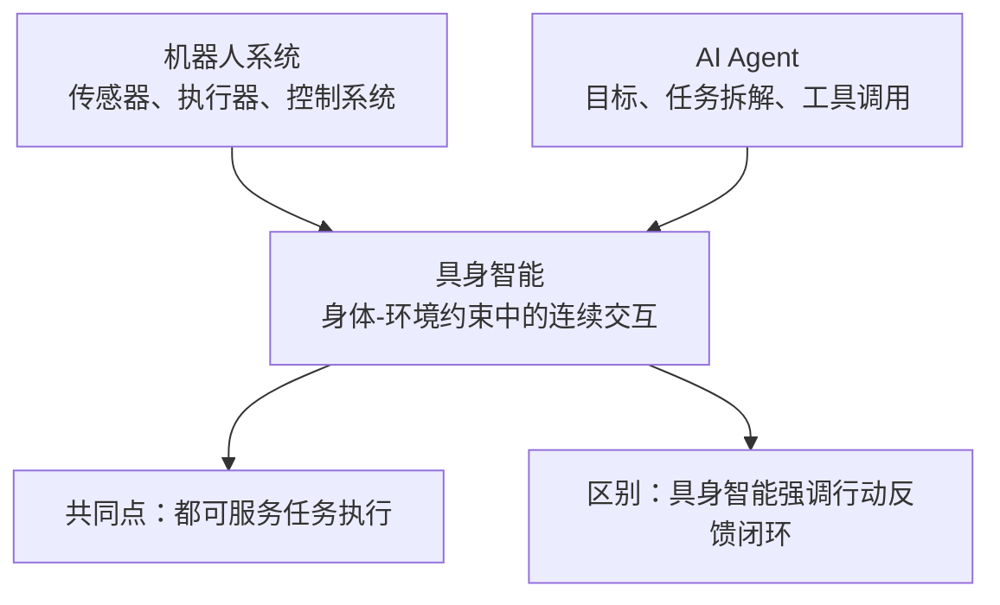
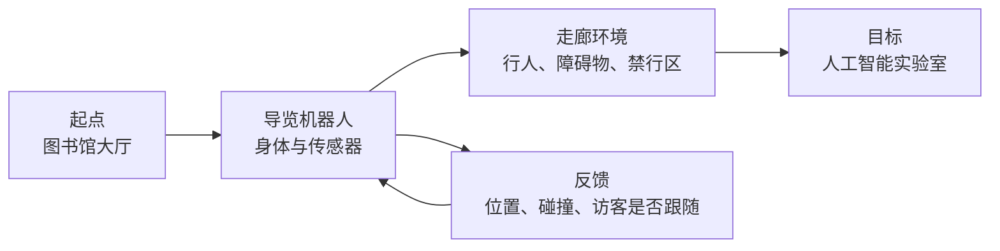
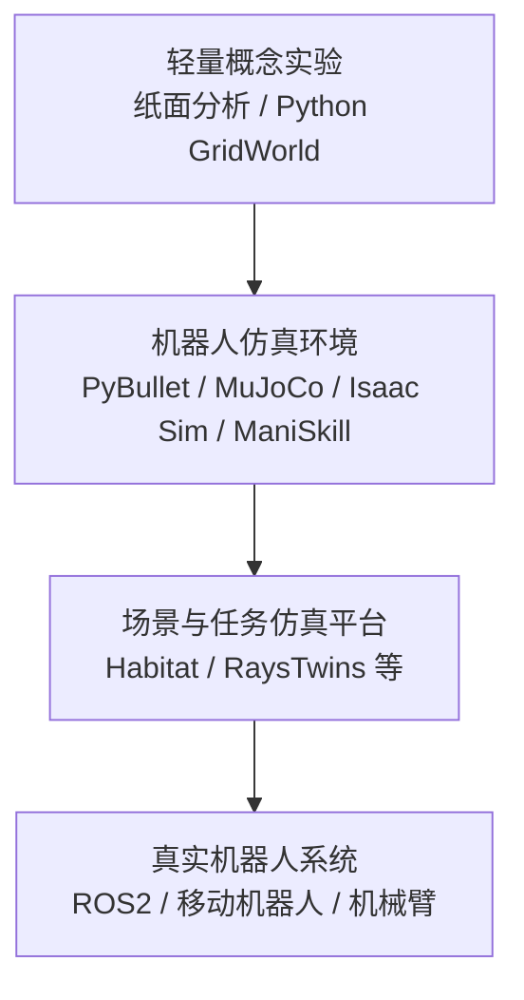

# 第 1 章 具身智能概论

## 1. 本章导读

传统人工智能课程通常从图像分类、文本生成、搜索规划或推荐系统讲起。这些系统能够在给定数据上完成识别、预测或生成任务，但它们大多不直接改变外部环境，也不需要持续承担行动后果。具身智能关注的问题有所不同：智能体不仅要理解环境，还要在环境中行动，并根据行动后的反馈修正自身行为。

例如，一台校园导览机器人接到指令：“请带访客从图书馆大厅到人工智能实验室。”它需要定位当前位置，识别可通行区域，规划路线，控制底盘移动，避开行人，并在道路阻塞或访客掉队时重新调整策略。这个过程不是单一模型的一次输出，而是身体、环境、任务、感知、规划、行动和反馈共同构成的连续闭环。

本章作为全书导论，重点完成三件事：给出具身智能的基本定义，建立感知-规划-行动-反馈闭环，说明本课程从概念、系统、算法、仿真到项目实践的学习路径。RaysTwins 等仿真平台将在本书中作为教学辅助工具出现，用于帮助学生观察任务闭环和实验过程；具体平台接口、任务包格式和部署细节将在后续章节或实验手册中展开，资料缺失处统一标注“需平台方补充”。

## 2. 学习目标

学完本章后，学生应能够：

1. 说明具身智能的基本含义，并区分具身智能、普通人工智能、机器人系统和 AI Agent（人工智能智能体）。
2. 理解身体、环境、任务、观测、状态、动作、目标和反馈在具身智能系统中的作用。
3. 用感知-规划-行动-反馈闭环描述一个简单具身智能任务。
4. 识别具身智能任务中的正例、反例和边界例。
5. 初步说明仿真平台在具身智能教学中的作用与边界。

## 3. 关键问题

1. 为什么仅有感知、生成或对话能力，还不足以构成完整的具身智能系统？
2. 具身智能系统中的“身体”“环境”“任务”和“反馈”分别起什么作用？
3. 如何用观测、状态、动作、目标、反馈和策略描述一个具身智能任务？
4. 机器人系统、AI Agent 和具身智能体之间有什么联系与区别？
5. 仿真平台能帮助学生观察什么，又不能替代哪些基本原理？

## 4. 核心概念

表 1-1 给出本章使用的核心概念。后续章节会在机器人基础、任务建模、导航、操作、学习和仿真平台中继续展开这些概念。

表 1-1 具身智能概论中的核心概念

| 概念 | 英文术语 | 简要说明 |
|---|---|---|
| 具身智能 | Embodied AI | 在身体、环境和任务约束中通过感知、规划、行动和反馈实现智能行为的人工智能形态。 |
| 具身智能体 | Embodied Agent | 能够在环境中接收感知信息、形成任务决策并通过动作影响环境的智能体。 |
| 感知-规划-行动-反馈闭环 | Perception-Planning-Action-Feedback Loop | 智能体从环境获取信息、生成计划、执行动作并依据结果调整行为的基本闭环。 |
| 观测 | Observation | 智能体通过传感器、接口或环境输入获得的当前信息。 |
| 状态 | State | 智能体对自身和环境形成的内部表示。 |
| 动作 | Action | 智能体在当前时刻执行的移动、操作、语音提示或控制指令。 |
| 目标 | Goal | 任务希望达到的位置、状态或结果。 |
| 反馈 | Feedback | 行动后获得的状态变化、评价信号或错误信息。 |

> **定义 1-1 具身智能**
> 具身智能是指智能体依托物理或虚拟身体，在环境约束和任务目标下，通过感知、规划、行动与反馈形成闭环，并在交互过程中表现出适应性行为的人工智能形态。

> **定义 1-2 具身智能体**
> 具身智能体是具备感知、决策和行动能力，并能通过身体与环境发生交互的智能体。这里的身体既可以是真实机器人，也可以是仿真环境或虚拟场景中的可行动主体。

> **例 1-1 校园导览机器人**
> 当校园导览机器人接到“请带访客去人工智能实验室”的指令时，它需要定位当前位置，识别可通行区域，规划路线，控制底盘移动，避开行人，并在道路阻塞时重新规划。这个例子体现了具身智能的基本闭环：感知环境、形成计划、执行动作、接收反馈并继续调整。

> **概念辨析 1-1 具身智能、机器人与 AI Agent**
> 机器人强调传感器、执行器、控制系统和物理结构，是具身智能的重要载体；AI Agent 强调目标驱动的任务拆解、工具调用和多步执行；具身智能强调智能体在身体和环境约束下完成连续交互。三者可以结合，但不能简单等同。

## 5. 理论基础

### 5.1 从数据智能到具身智能

许多人工智能系统主要处理静态数据或离线数据。图像分类模型接收一张图像并输出类别，语言模型接收一段文本并生成回答，推荐系统根据用户行为预测可能感兴趣的内容。这类系统的重要特点是：输入与输出之间存在明确的数据接口，模型通常不直接改变外部环境。

具身智能系统面对的是更复杂的交互过程。智能体的动作会改变环境状态，环境状态的变化又会影响下一次感知和决策。例如，移动机器人向前移动一步后，传感器观测、可通行区域、障碍物距离和任务进度都会发生变化。因此，具身智能不能只看单次推理结果，还必须关注连续时间中的状态变化和行动后果。

表 1-2 展示了从数据智能到具身智能的能力递进关系。这里的“递进”不是替代关系，而是说明具身智能常常需要综合使用感知、生成、规划和控制等多类能力。

表 1-2 从数据智能到具身智能的能力递进

| 层次 | 典型能力 | 主要问题 | 局限 |
|---|---|---|---|
| 感知智能 | 识别图像、语音、文本和环境信号 | 看到了什么 | 不能直接完成行动 |
| 生成智能 | 生成文本、图像、代码或计划草案 | 可以生成什么 | 不一定能执行 |
| 智能体能力 | 拆解任务、调用工具、形成多步计划 | 如何组织任务 | 需要外部执行和反馈 |
| 具身智能 | 在身体和环境约束中完成闭环行动 | 如何在环境中完成目标 | 需要面对物理约束、失败恢复和安全边界 |



图 1-1 展示了从普通人工智能能力到具身智能能力的递进关系。具身智能不是替代感知智能、生成智能或 AI Agent，而是在这些能力基础上进一步引入身体、环境、行动和反馈。

### 5.2 最小形式化框架

为了给后续任务建模、强化学习、模仿学习和任务规划打基础，本章先引入一个轻量形式化框架。它不要求学生掌握复杂数学推导，而是帮助学生统一描述具身智能任务。

表 1-3 具身智能任务的最小形式化要素

| 符号 | 含义 | 校园导览任务示例 |
|---|---|---|
| `o_t` | 时刻 `t` 的观测 | 摄像头画面、里程计、障碍物距离 |
| `s_t` | 时刻 `t` 的内部状态表示 | 机器人位置、目标位置、地图局部信息 |
| `g` | 任务目标 | 到达人工智能实验室门口 |
| `a_t` | 时刻 `t` 的动作 | 前进、转向、停止、语音提示 |
| `f_{t+1}` | 行动后的反馈 | 是否接近目标、是否碰撞、访客是否跟随 |
| `π` | 从观测、状态和目标到动作的策略 | 根据当前位置和目标选择下一步动作 |

在时刻 `t`，具身智能体依据观测 `o_t`、内部状态 `s_t` 和目标 `g` 选择动作 `a_t`；动作改变环境后，系统获得新的观测和反馈 `f_{t+1}`，并进入下一轮决策。这个过程说明，具身智能不是一次性输出答案，而是在行动、观察和修正中逐步接近目标。



图 1-2 展示了具身智能的感知-规划-行动-反馈闭环。智能体依据任务目标、观测和状态表示生成动作，动作改变环境并产生反馈，反馈再进入下一轮状态更新和决策。

### 5.3 身体、环境、任务与反馈

“具身”强调智能不是孤立发生在模型内部，而是发生在智能体与环境交互的过程中。一个具身智能任务至少包含身体、环境、任务和反馈四类要素。

身体决定智能体能够感知什么、能执行什么动作。移动机器人可以在地面行驶，但不能直接抓取高处物体；机械臂可以操作桌面物体，但移动范围受到基座和关节限制。身体形态影响动作空间，也影响任务可行性。

环境提供任务发生的空间和规则。环境可以是真实教室、仓储通道、实验桌面，也可以是仿真平台中的数字孪生场景。环境可能包含静态障碍物，也可能包含行人、移动货架、动态光照等变化因素。

任务规定智能体要完成什么目标，以及什么算成功或失败。导航任务可能要求从起点到达终点且不发生碰撞；抓取任务可能要求识别目标物体、完成抓取并放置到指定区域；巡检任务可能要求覆盖若干检测点并记录异常。

反馈使系统能够判断行动后果。反馈可以来自传感器观测、碰撞检测、距离变化、成功率、任务时间、能耗，也可以来自人工评价或奖励函数。没有反馈，智能体就难以发现偏差，更难进行学习和改进。

### 5.4 正例、反例与边界例

具身智能并不等同于“有机器人外形”，也不等同于“会生成计划”。判断一个系统是否进入具身智能问题域，应看它是否在身体和环境约束下形成了连续行动闭环。

表 1-4 具身智能概念辨析示例

| 类型 | 示例 | 说明 |
|---|---|---|
| 正例 | 校园导览机器人、仓储导航机器人、桌面操作机器人 | 需要感知环境、执行动作、接收反馈并调整行为 |
| 反例 | 只按固定轨迹运行的自动化设备 | 有物理身体，但缺少环境感知和失败恢复 |
| 反例 | 只生成文字计划的聊天机器人 | 能进行任务分解，但不直接执行身体动作 |
| 边界例 | 手机导航 | 能感知位置并规划路径，但行动主体主要是人 |
| 边界例 | 虚拟游戏智能体 | 若在虚拟环境中感知、行动并接收反馈，可作为具身智能教学对象 |



图 1-3 展示了具身智能、机器人系统与 AI Agent 的关系。机器人系统提供身体和执行载体，AI Agent 提供目标驱动的任务组织能力，具身智能则强调身体与环境约束中的连续行动反馈闭环。

## 6. 方法与算法：具身智能任务分析框架

### 6.1 任务要素分解

分析具身智能任务时，可以先把任务拆解为若干基本问题：

1. 智能体是谁：机器人或虚拟智能体的身体形态、传感器和执行器是什么。
2. 环境在哪里：任务发生在什么空间，包含哪些对象、障碍和动态因素。
3. 目标是什么：需要达到的位置、状态或操作结果是什么。
4. 观测是什么：智能体能够获得哪些环境信息和自身状态信息。
5. 动作是什么：智能体能够执行哪些移动、操作或交互行为。
6. 约束是什么：时间、安全、能耗、路径、碰撞和操作范围有哪些限制。
7. 如何反馈：系统如何记录过程、发现偏差并改进行为。

这种分析方法并不依赖某一个平台。无论使用纸面任务分析、Python 网格世界、机器人仿真环境，还是使用数字孪生仿真平台，都需要先明确这些基本要素。

### 6.2 行动闭环分析

具身智能系统通常可以用闭环流程描述：

```text
环境与任务目标
  ↓
观测：获取图像、深度、位置、速度、接触等信息
  ↓
状态表示：形成对自身和环境的内部表示
  ↓
规划与决策：根据目标、约束和当前状态选择行动方案
  ↓
行动：通过执行器或虚拟身体影响环境
  ↓
反馈：记录结果、评价成功或失败，并进入下一轮决策
```

闭环的关键在于“行动后再观察”。如果智能体只根据初始信息制定计划，却不根据执行结果调整策略，那么它很容易在动态环境中失败。例如，导航机器人原计划沿直线路径前进，但中途出现行人时，就需要通过新的观测结果重新规划。

### 6.3 校园导览任务分析

以校园导览任务为例，可以把系统要素整理如下。

表 1-5 校园导览任务的基本要素

| 要素 | 含义 | 校园导览任务示例 |
|---|---|---|
| 身体 | 智能体执行感知和行动的载体 | 轮式机器人、摄像头、里程计、扬声器 |
| 环境 | 智能体所在并与之交互的空间 | 图书馆大厅、走廊、电梯口、实验室门口 |
| 目标 | 任务希望达到的状态或结果 | 将访客带到人工智能实验室 |
| 观测 | 智能体获得的信息 | 当前位置、可通行区域、障碍物距离 |
| 动作 | 智能体可以执行的行为 | 前进、转向、停止、语音提示 |
| 约束 | 行动必须满足的限制条件 | 不碰撞、不进入禁行区域、保持安全速度 |
| 反馈 | 判断行动结果的信息 | 是否到达、路径长度、碰撞次数、访客是否跟随 |

该示例体现了具身智能的综合性：感知模块负责获得环境信息，规划模块负责选择行动方案，控制模块负责执行运动，评估模块负责判断任务完成质量。



图 1-4 以校园导览任务为例，说明具身智能任务中的身体、环境、目标和反馈。图中路径不是固定脚本，而是需要根据行人、障碍物和访客跟随状态持续调整的行动过程。

## 7. 平台与工具

本章只从教学层级角度说明平台作用。平台不是本章重点，详细对照将在第 12 章“数字孪生与具身仿真平台”和第 14 章“高校实验平台与课程实践”中展开。

表 1-6 具身智能课程中的平台层级

| 层级 | 典型工具 | 教学作用 |
|---|---|---|
| 轻量概念实验 | 纸面分析、Python + GridWorld | 理解状态、动作、目标、反馈和路径搜索 |
| 机器人仿真环境 | PyBullet、MuJoCo、Isaac Sim / Isaac Lab、ManiSkill | 理解物理约束、运动控制、操作和学习任务 |
| 场景与任务仿真平台 | Habitat、RaysTwins 等 | 观察场景构建、任务执行、回放评估和课程项目流程 |
| 真实机器人系统 | ROS2、移动机器人、机械臂等 | 理解真实部署、传感器误差、安全边界和 Sim2Real 问题 |



图 1-5 展示了本课程实验平台层级。不同平台层级服务不同教学目标：轻量实验用于理解概念，机器人仿真用于观察物理和控制约束，场景仿真用于组织任务流程，真实机器人系统用于理解部署边界和 Sim2Real 问题。

选择平台时应关注课程目标，而不是平台本身。若目标是理解状态、动作和反馈，轻量网格世界已经足够；若目标是理解运动控制和物理约束，可以选择机器人仿真环境；若目标是观察复杂场景中的任务执行和回放评估，可以引入数字孪生或具身仿真平台。涉及具体安装部署、任务包 schema、SDK、API 或 Runner 命令时，如资料缺失，统一标注“需平台方补充”。

## 8. RaysTwins 教学辅助案例

> RaysTwins 可作为教学辅助仿真平台，用于支撑数字孪生场景构建、任务包配置、仿真执行、训练推理、回放评估等实践环节。

在第 1 章中，RaysTwins 只作为观察具身智能闭环的教学辅助案例。教师可以选择一个简单的校园导览或仓储导航场景，让学生观察机器人、目标点、障碍物、可通行区域和任务反馈之间的关系。该案例的重点不是学习平台操作，而是帮助学生把“身体-环境-任务-反馈”四类要素与“感知-规划-行动-反馈”闭环对应起来。

教学活动可采用平台无关的描述：先明确任务主体和环境范围，再说明目标位置、可执行动作、约束条件和评价指标，最后通过仿真过程或回放材料观察任务是否完成。若需要使用 RaysTwins 的任务包字段、官方 schema、运行命令、SDK、API、Runner 或回放文件格式，需平台方补充正式资料。本书将在后续章节和实验手册中再讨论平台配置、任务执行和评估报告等细节。

通过这个案例，学生应认识到：仿真平台的价值在于提供可观察、可复盘、可比较的实验场，而不是替代具身智能的基本原理。平台内容必须服务教学目标，不能喧宾夺主。

## 配图规划

本章已在正文中嵌入 Mermaid 图，后续可从 `figures/ch01/` 下的源文件导出 SVG 用于正式排版。

| 图号 | 图名 | 类型 | 作用 | 建议位置 | 文件路径 |
|---|---|---|---|---|---|
| 图 1-1 | 从普通 AI 到具身智能的能力递进 | 概念层级图 | 展示感知智能、生成智能、Agent、具身智能的关系 | 5.1 节 | `figures/ch01/fig1-1_ai_to_embodied_ai.mmd` |
| 图 1-2 | 具身智能的感知-规划-行动-反馈闭环 | 流程图 | 建立全书核心框架 | 5.2 节 | `figures/ch01/fig1-2_embodied_loop.mmd` |
| 图 1-3 | 具身智能、机器人与 AI Agent 的关系 | 关系图 | 做概念辨析 | 5.4 节 | `figures/ch01/fig1-3_robot_agent_embodied_relation.mmd` |
| 图 1-4 | 校园导览机器人任务示意图 | 场景示意图 | 展示身体、环境、目标、障碍物和反馈 | 6.3 节 | `figures/ch01/fig1-4_campus_navigation_task.mmd` |
| 图 1-5 | 本课程实验平台层级 | 分层架构图 | 说明轻量实验、机器人仿真、场景仿真和真实机器人系统的教学分工 | 7 节 | `figures/ch01/fig1-5_teaching_platform_layers.mmd` |

## 9. 本章小结

1. 具身智能强调智能体在身体、环境和任务约束中，通过感知、规划、行动和反馈形成闭环。
2. 具身智能不同于单纯的图像识别、文本生成或工具调用，它必须面对连续交互、物理约束和行动后果。
3. 观测、状态、目标、动作、反馈和策略构成描述具身智能任务的最小形式化框架。
4. 机器人系统、AI Agent 和具身智能可以相互结合，但不能简单等同。
5. 仿真平台可以支撑教学实验、任务回放和评估，但不能替代对通用原理的理解。

## 10. 思考题

### 基础理解题

1. 用自己的话解释具身智能，并说明“身体”和“环境”为什么重要。
2. 说明观测 `o_t`、状态 `s_t`、动作 `a_t`、目标 `g` 和反馈 `f_{t+1}` 的含义。

### 概念辨析题

3. 比较机器人系统、AI Agent 和具身智能体三者的联系与区别。
4. 为什么一台只按固定轨迹运行的自动化设备不一定能体现具身智能？

### 应用分析题

5. 选择一个校园或生活场景，说明其中哪些任务可以被建模为具身智能任务，哪些任务更适合普通软件系统完成。
6. 如果一个仿真导航任务成功完成，但真实机器人部署失败，可能有哪些原因？

### 拓展讨论题

7. 在教学中引入仿真平台有哪些优点和局限？
8. 虚拟游戏智能体在什么条件下可以作为具身智能教学案例？

## 11. 实验任务

### 11.1 实验名称

具身智能任务要素识别与闭环分析。

### 11.2 实验目标

本实验要求学生选择一个简单具身智能任务，完成任务要素识别和闭环分析。实验重点不是编写复杂代码，而是建立系统化分析方法。

### 11.3 实验环境

可选环境：

- 纸面分析或 Markdown 实验报告。
- Python 绘制简单网格地图。
- 可选仿真平台：PyBullet、MuJoCo、Isaac Sim / Isaac Lab、ManiSkill、RaysTwins 等。

如使用 RaysTwins，安装部署、账号申请、任务包官方 schema、运行命令、回放文件格式和评测指标样例需平台方补充。

### 11.4 实验步骤

1. 选择一个任务，例如校园导览、仓储搬运、桌面抓取或工业巡检。
2. 描述任务场景，包括空间范围、对象、障碍物和动态因素。
3. 填写任务要素表：身体、环境、目标、观测、状态、动作、约束、反馈。
4. 绘制感知-规划-行动-反馈闭环图。
5. 设计至少 3 个评价指标，例如成功率、路径长度、任务时间或碰撞次数。
6. 分析至少 2 种可能失败情况，并提出改进建议。

### 11.5 结果记录

| 记录项 | 记录内容 |
|---|---|
| 输入 | 任务场景描述、目标、约束、可用观测信息 |
| 输出 | 任务要素表、闭环流程图、评价指标清单 |
| 指标 | 成功率、路径长度、任务时间、碰撞次数等 |
| 失败现象 | 例如无法定位、路径被阻挡、目标识别错误、动作执行偏差 |
| 改进建议 | 例如增加观测信息、重新规划路径、调整评价指标、改进任务定义 |

### 11.6 评分标准

| 维度 | 分值 | 说明 |
|---|---:|---|
| 任务定义 | 20 | 场景、目标、约束和输入输出是否清晰。 |
| 闭环分析 | 30 | 是否准确描述感知、规划、行动和反馈关系。 |
| 指标设计 | 20 | 是否提出可观察、可记录、可比较的评价指标。 |
| 失败分析 | 20 | 是否能识别可能失败原因并提出合理改进建议。 |
| 报告表达 | 10 | 报告结构是否清楚，表格和图示是否规范。 |

## 12. 拓展阅读

### 基础教材

- 强化学习基础教材：待 Human Editor 对照 `references/sources.yaml` 核验后补入。

### 机器人与强化学习

- 机器人学与控制基础教材：待 Human Editor 对照 `references/sources.yaml` 核验后补入。

### 具身智能平台

- 仿真平台官方文档：待 Human Editor 对照 `references/sources.yaml` 核验后补入。

### 本书后续章节对应阅读

- 第 2 章将进一步讨论具身智能系统架构。
- 第 4 章将进一步讨论具身智能任务建模。
- 第 12 章将进一步讨论数字孪生与具身仿真平台。

<!-- writer-selfcheck
chapter: ch01
template_sections_complete: true
raystwins_within_1_2_pages: true
no_fabricated_platform_details: true
figures_embedded_in_body: true
figures_planned:
  - 图 1-1 从普通 AI 到具身智能的能力递进 -> figures/ch01/fig1-1_ai_to_embodied_ai.mmd
  - 图 1-2 具身智能的感知-规划-行动-反馈闭环 -> figures/ch01/fig1-2_embodied_loop.mmd
  - 图 1-3 具身智能、机器人与 AI Agent 的关系 -> figures/ch01/fig1-3_robot_agent_embodied_relation.mmd
  - 图 1-4 校园导览机器人任务示意图 -> figures/ch01/fig1-4_campus_navigation_task.mmd
  - 图 1-5 本课程实验平台层级 -> figures/ch01/fig1-5_teaching_platform_layers.mmd
style_boxes_used:
  - 定义 1-1 具身智能
  - 定义 1-2 具身智能体
  - 例 1-1 校园导览机器人
  - 概念辨析 1-1 具身智能、机器人与 AI Agent
content_boundary_ok: true
vendor_todo:
  - RaysTwins 安装部署、账号申请、任务包官方 schema、运行命令、回放文件格式和评测指标样例
  - RaysTwins 的 SDK、API、Runner 和训练推理接口资料（需平台方补充）
human_confirm:
  - 拓展阅读具体来源已暂缓列入，需由 Human Editor 对照 references/sources.yaml 核验后补入
sources_cited: []
-->
