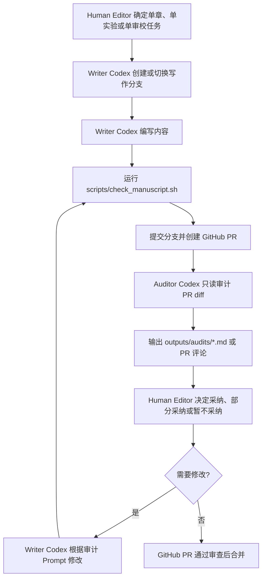

# Codex 教材协作流程设计

本文档统一规定《具身智能导论：从数字孪生仿真到智能体实践》的写作、审计、人工编辑与 GitHub PR 合并流程。

## 1. 角色分工

| 角色 | 权限 | 主要任务 | 输出物 | 不做什么 |
|---|---|---|---|---|
| Writer Codex | 可写正文，使用 workspace-write | 编写章节、实验、模板和配套材料 | `manuscript/`、`labs/`、`teacher/`、`student/` 下的内容草稿 | 不自行决定合并，不绕过审计 |
| Auditor Codex | 默认只读，只输出审计报告 | 审查结构、口吻、RaysTwins 边界、事实风险和实验可执行性 | `outputs/audits/*.md` | 不直接修改正文，不替主编裁决 |
| Human Editor | 人工裁决 | 判断审计意见是否采纳，决定修改范围和发布节奏 | PR 评论、修改指令、采纳结论 | 不把未审计内容直接合并 |
| GitHub PR | 最终合并闸门 | 汇集 diff、审计报告、人工意见和检查结果 | PR、Review、Checks、Merge 记录 | 不替代人工内容判断 |

核心原则：

> 写作 Codex 负责生产，审计 Codex 负责质检，人负责裁决，GitHub PR 负责留痕和合并控制。

## 2. 标准流程



## 3. 分支与任务粒度

每次只处理一个章节、一个实验或一个审校任务。

推荐分支命名：

| 任务类型 | 分支示例 |
|---|---|
| 章节写作 | `codex/ch01-intro` |
| 实验手册 | `codex/lab01-gridworld` |
| 课程配套 | `codex/teacher-syllabus` |
| 审计报告 | `codex/audit-ch01-intro` |
| 流程或规范 | `codex/editorial-workflow` |

## 4. Writer Codex 流程

Writer Codex 写作前必须读取：

1. `AGENTS.md`
2. `metadata/course_spec.yaml`
3. `metadata/terminology.yaml`
4. `manuscript/book_outline.md`
5. `manuscript/chapter_template.md`
6. `references/sources.yaml`（引用白名单，拓展阅读须出自此处）
7. `planning/STATUS.md`（确认任务状态与阻塞）
8. 与当前任务相关的参考资料

Writer Codex 写作约束：

- 先讲通用原理，再讲主流平台对照，最后给出 RaysTwins 教学辅助案例。
- 不得把教材写成 RaysTwins 产品宣传册或操作手册。
- 不编造 RaysTwins SDK、API、任务包 schema、Runner 命令。
- 涉及缺失资料时标注“需平台方补充”。
- 修改后运行 `scripts/check_manuscript.sh`（设 `LINT_STRICT=1` 可将 warning 视为失败）。
- 在章节文件末尾追加 `writer-selfcheck` HTML 注释（自检清单 + 需平台方补充 + 需人工确认 + 引用来源 id）。
- 完成后更新 `planning/STATUS.md` 对应行。
- 基础实验优先复用 `labs/common`（纯 Python、零依赖）的任务包/Runner/回放/指标框架。

可使用提示词：

```bash
codex exec --sandbox workspace-write "$(cat prompts/writer/01_write_chapter.md)"
```

## 5. Auditor Codex 流程

Auditor Codex 默认只读。它只审查，不直接改正文。

Auditor Codex 审计前必须读取：

1. `AGENTS.md`
2. `audit/AUDITOR.md`
3. `metadata/course_spec.yaml`
4. `metadata/terminology.yaml`
5. `manuscript/book_outline.md`
6. `references/sources.yaml`（核对引用是否在白名单且 verified）
7. 当前分支相对于 `main` 或 `origin/main` 的 diff

Auditor Codex 输出（报告须以机读 YAML front-matter 开头，含 `verdict: pass|fix|block`）：

- 总体结论。
- 阻塞合并的问题。
- 建议修改的问题。
- RaysTwins 边界检查。
- 高校教材适配检查。
- 实验可执行性检查。
- 需平台方补充资料。
- 给 Writer Codex 的修改 Prompt。
- 合并建议：可以合并 / 修改后合并 / 不建议合并。

本地审计命令：

```bash
scripts/audit_current_branch.sh
```

脚本会生成：

- `outputs/audits/<branch>.diff.patch`
- `outputs/audits/<branch>.staged.patch`
- `outputs/audits/<branch>.worktree.patch`
- `outputs/audits/<branch>_check.log`
- `outputs/audits/<branch>_audit.md`

并在末尾调用 `scripts/audit_verdict.py` 解析报告 front-matter，
打印机读裁决（退出码 0=pass / 1=fix / 2=block / 3=缺少 front-matter）。

## 6. Human Editor 流程

Human Editor 对审计报告做三类裁决：

| 裁决 | 含义 | 下一步 |
|---|---|---|
| 采纳 | 审计意见成立且需要修改 | 交给 Writer Codex 修改 |
| 部分采纳 | 问题成立，但修改范围需要调整 | 人工改写为新的 Writer Prompt |
| 暂不采纳 | 问题不影响当前版本或需更多资料 | 在 PR 中说明原因 |

Human Editor 需要重点判断：

- 内容是否保持高校教材口吻。
- RaysTwins 是否只是教学辅助平台。
- 实验是否足够可执行。
- 是否存在未经证实的平台能力表述。
- 当前任务是否仍然保持“小步提交”。

## 7. GitHub PR 合并闸门

PR 合并前建议至少满足：

1. PR 只覆盖一个章节、一个实验或一个审校任务。
2. `scripts/check_manuscript.sh` 通过，或已说明未通过原因。
3. 有 Auditor Codex 审计报告或 PR 审计评论。
4. Human Editor 明确同意合并。
5. RaysTwins 技术细节没有无来源断言。
6. 需要平台方补充的内容已标注。

后续如启用分支保护，可将以下内容设置为合并条件：

- 至少一次人工 review。
- 必要的状态检查通过。
- 禁止直接 push 到 `main`。
- 所有讨论已解决后才能合并。

## 8. 最小可执行闭环

第一阶段先采用本地手动审计：

```bash
git checkout -b codex/ch01-intro
# Writer Codex 写作
scripts/check_manuscript.sh
# 提交并发 PR
scripts/audit_current_branch.sh
# Human Editor 根据 outputs/audits/*.md 决定是否采纳
```

第二阶段再考虑将审计报告贴到 PR 评论中。

确定性检查（`scripts/check_manuscript.sh`）已通过 `.github/workflows/manuscript-check.yml`
在 PR/push 上自动运行，无需密钥与费用，可直接作为合并前的第一道闸门。

第三阶段再考虑 GitHub Actions 跑 Codex 自动审计。该步骤涉及密钥、费用、权限和输出稳定性，
建议在本地审计流程稳定后再做。

