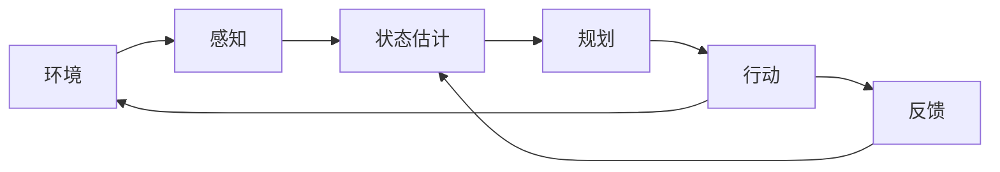

# 配图规范

本规范用于教材正文、实验手册和审计报告中的配图规划。配图服务教学目标，不服务平台宣传。

## 1. 配图原则

1. 教材图优先使用矢量图：流程图、系统图、架构图首选 SVG，源图可使用 Mermaid。
2. 截图必须服务教学目标：平台截图应说明“观察什么”，避免纯界面展示。
3. 图号按章节编号：第 1 章使用“图 1-1”“图 1-2”，第 12 章使用“图 12-1”。
4. 图题应能独立说明图片含义，图注不超过 100-150 字。
5. 避免宣传化图片：不得使用营销口号、夸张效果或销售话术。
6. 版权可控：平台截图、Logo、机器人图片、场景素材必须有授权，或使用自绘图。

## 2. 文件命名

```text
figures/ch01/fig1-1_ai_to_embodied_ai.svg
figures/ch01/fig1-2_embodied_loop.svg
figures/ch01/fig1-3_robot_agent_embodied_relation.svg
figures/ch01/fig1-4_campus_navigation_task.svg
figures/ch01/fig1-5_teaching_platform_layers.svg
```

命名规则：

- 目录：`figures/chXX/`，章节号用两位数字。
- 文件：`fig<章号>-<图序号>_<英文小写语义名>.<ext>`。
- 英文语义名使用小写字母、数字和下划线。
- Mermaid 源图可使用 `.mmd`，导出图使用 `.svg`。

## 3. 格式要求

| 图片类型 | 首选格式 | 备用格式 | 要求 |
|---|---|---|---|
| 流程图 / 架构图 | SVG | PDF / PNG | 矢量优先；PNG 不低于 300 dpi |
| 教学示意图 | SVG | PNG | 宽度建议 1600 px 以上 |
| 平台截图 | PNG | JPG | 宽度建议 1920 px，关键信息清晰可读 |
| 复杂系统图 | SVG + 源文件 | PDF | 必须保留可编辑源文件 |
| 印刷用图片 | PDF / TIFF | PNG | 300 dpi 以上 |

## 4. Markdown 插图格式

```markdown


图 1-2 展示了具身智能系统的基本闭环。智能体通过感知模块获取环境信息，经过状态估计和任务规划生成动作，并通过执行器影响环境；行动结果再次形成反馈，进入下一轮决策。
```

要求：

- 图片 alt 文本以“图 X-Y”开头。
- 图片路径遵循 `figures/chXX/figX-Y_name.svg` 规则。
- 图注紧跟图片，不写空泛描述。

## 5. Mermaid 源图

暂时没有专业制图时，可先创建 Mermaid 源图，再导出 SVG。



建议保存为：

```text
figures/ch01/fig1-2_embodied_loop.mmd
figures/ch01/fig1-2_embodied_loop.svg
```

## 6. 章节配图清单模板

每章写作或审校时，至少给出配图规划表。

| 图号 | 图名 | 类型 | 作用 | 建议位置 | 文件路径 |
|---|---|---|---|---|---|
| 图 X-1 |  | 流程图 / 架构图 / 示意图 / 截图 |  |  | `figures/chXX/figX-1_name.svg` |

## 7. 第 1 章建议配图

| 图号 | 图名 | 类型 | 作用 | 建议位置 |
|---|---|---|---|---|
| 图 1-1 | 从普通 AI 到具身智能的能力递进 | 概念层级图 | 展示感知智能、生成智能、Agent、具身智能的关系 | 1.5 节 |
| 图 1-2 | 具身智能的感知-规划-行动-反馈闭环 | 流程图 | 建立全书核心框架 | 1.6 节 |
| 图 1-3 | 具身智能、机器人与 AI Agent 的关系 | 维恩图或关系图 | 做概念辨析 | 1.7 节 |
| 图 1-4 | 校园导览机器人任务示意图 | 场景示意图 | 展示身体、环境、目标、障碍物和反馈 | 1.8 节 |
| 图 1-5 | 本课程实验平台层级 | 分层架构图 | 说明 GridWorld、机器人仿真、数字孪生平台的教学分工 | 1.9 节 |

